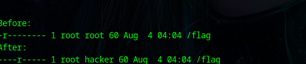

<small>walktrough for access control</small>

level 1:

The hacker user has a read permission to the file flag . so we can simply read the flag and see 

level 2:

The hacker group has a read permission to the file flag . so we can simply read the flag and see

level 3:

we can see the hacker user has become the owner of the file 

so we can add the read permission to the file by chmod and we cat and see the /flag file