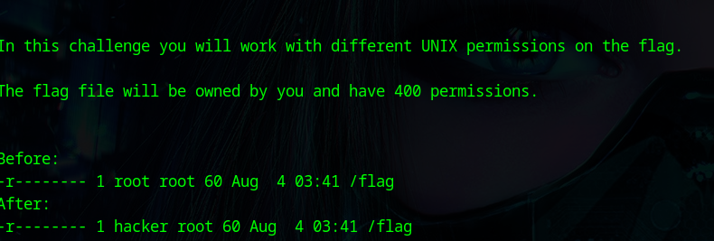

<small>walktrough for access control</small>

level 1:

The hacker user has a read permission to the file flag . so we can simply read the flag and see 

level 2:

The hacker group has a read permission to the file flag . so we can simply read the flag and see

level 3:

we can see the hacker user has become the owner of the file 

so we can add the read permission to the file by chmod and we cat and see the /flag file

level 4:

In this challenge the suid is set to the binary /bin/cat we can use that binary to see the /flag file

/bin/cat /flag

level 5:

In this challenge the suid is set for the binary /bin/cp so we can copy the content in the file /flag  with the help of that into another file and we can cat and see the file 

In this challenge when we cp the file the directly from the flag  and adding the contents to the new file we cna t able to cat and see the file 

so we need to fist create file and then we need to copy the flag file contents to that file

Level 6:

In this challenge we want to add the user to the group and we also knew the passwd for the group 

so we can use the command

           newgrp <group-name>
           
           and enter the passwd

           this will not permanently add the user to the group but it will tempporarily add the user to that group

           so we can now cat the /flag and see now flag